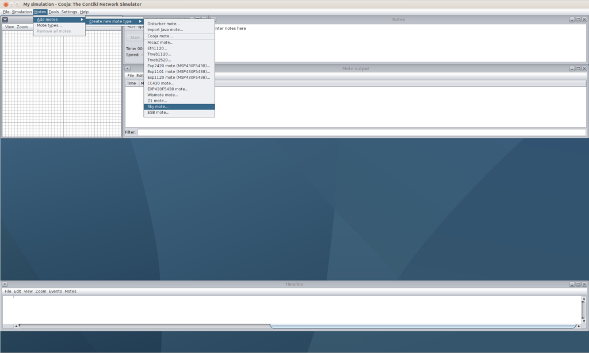
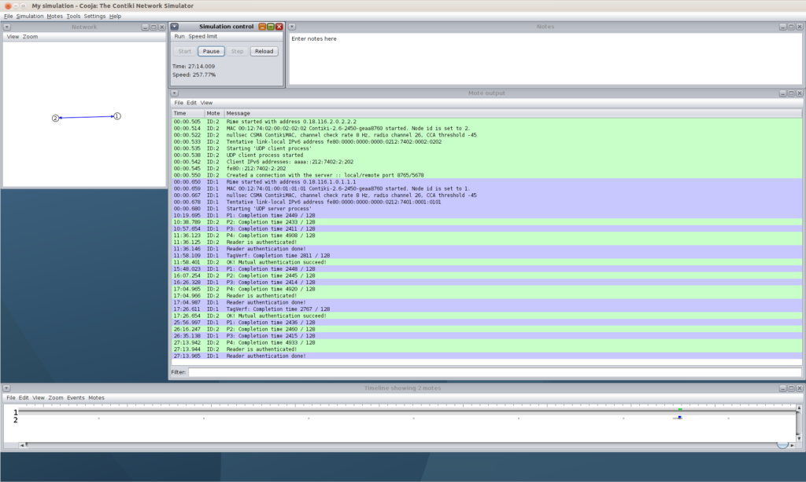

## Instructions for Contiki (Cooja) simulator

The instructions for use of IBIHOP source code in Contiki (Cooja) simulator are as following:

## System Setup

1. Go to the Contiki webpage: http://www.contiki-os.org/start.html, download Instant Contiki 3.0 and VMWare Player.

2. Unzip Instant Contiki 3.0 on desktop or preferred directory.

3. Open VMWare Player and run Instant_Contiki_Ubuntu_12.04_32-bit.vmx. Default login password is “user”.

4. Open a terminal and go to 

   ~/contiki/tools/cooja

   directory, run command:

   - $ git submodule update --init
   - $ ant run

   You may see the following screen.

   

 

## Build Simulation Network and Launch Simulation

Follow the instructions to run two-node mutual authentication with IBIHOP protocol.

1. Copy [IBIHOP source code](https://github.com/smit-project/contiki-ibihop) folder “IBIHOP” to the directory ~/contiki/examples/

2. Create a new simulation: Click “File” → “New simulation” → “Create”.

3. Add server mote (refer the following figure): Click “Motes” → “Add motes” → “Create new mote type” → “Sky mote…” → “Browse”. Then, choose the file server.c in IBIHOP folder. Click “Open” → “Compile” →”Create” → “Add motes”.

   

4. Add client mote: Click “Motes” → “Add motes” → “Create new mote type” → “Sky mote…” → “Browse”. Choose the file client.c in IBIHOP folder. Click “Open” → “Compile” → “Create” → “Add motes”.

5. Press “Start” in Simulation control window to run the experiment.

6. Use Pause, Step and Reload from Simulation control window to control an experiment.

**Note:** A tutorial can be found at http://www.contiki-os.org/start.html

 

## Experimental Result

Mote output window shows outputs of motes during the simulation.

1. Time column shows the time of printing the message. It can be used to check (by subtraction) the time consumption for a specific step

2. If your program prints out some messages, they will appear in the Message column as the following figure.

   